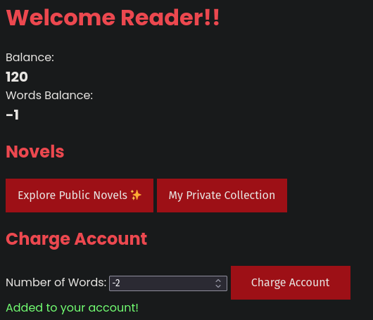

# Novel Reader 2 Writeup

by xhyr

Submit the second flag of "Novel Reader" here

## Initial Thoughts

I think we have to submit the hardcoded flag in the `A-Secret-Tale.txt` in here.

In the previous, challenge we already set up a directory traversal, where we got to read the first words in the private file. But we were not allowed to read the whole file since we did not have enough credits.

Now, lets figure out how to get some credits. Here is the concerned route for adding credits.

```python
@app.post('/api/charge')
def buyWord():
    nwords = request.args.get('nwords')
    if(nwords):
        nwords = int(nwords[:10])
        price = nwords * 10
        if(price <= session['credit']):
            session['credit'] -= price
            session['words_balance'] += nwords
            return {'success': True, 'msg': 'Added to your account!'}
        return {'success': False, 'msg': 'Not enough credit.'}, 402
    else:
        return {'success': False, 'msg': 'Missing parameteres.'}, 400
```

At first glance, the only check here is to see if the price is less than the credit. Also, there is no validation for nwords. So, we can just pass a negative number to this and it will behave in an intended manner.

Another thing I remembered from the first part of this challenge is this hacky implementation:

```python
@app.get('/api/read/<path:name>')
def readNovel(name):
    # some code...
    buf = readFile(name).split(' ')
    buf = ' '.join(buf[0:session['words_balance']])+'... Charge your account to unlock more of the novel!'
    return {'success': True, 'msg': buf}
```

So, passing -2 for the nwords we get this:



This will cause the `readNovel()` code to read from `buf[0:-1]` meaning it will read from the start to the end of the file. I guess you can also set it to 0 but I didnt try.

Then, using the directory traversal for the first challenge. We can now read the file.

```json
{
	"msg": "Once a upon time there was a flag. The flag was read like this: MAPNA{uhhh-y0u-607-m3-4641n-3f4b38571}.... Charge your account to unlock more of the novel!",
	"success": true
}
```

Then, we got the flag: MAPNA{uhhh-y0u-607-m3-4641n-3f4b38571}
